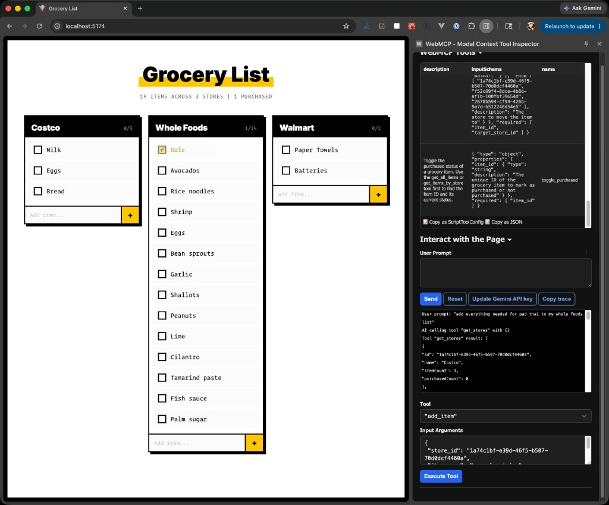

# WebMCP Grocery List

A demo grocery list app that exposes tools via the [WebMCP](https://developer.chrome.com/docs/ai/webmcp) declarative and imperative APIs. An AI agent can query stores/items, add/delete/move items, toggle purchased status, and manage store columns — all without screen-scraping.

> **Note:** WebMCP is an early-stage specification. This currently only works with Chrome 146+ and the [Model Context Tool Inspector](https://chromewebstore.google.com/detail/webmcp-model-context-tool/knkanehcjobalicepcnleoaoblbkllbp) extension. Enable the flag at `chrome://flags/#enable-webmcp-testing`.



## Setup

```bash
pnpm install
pnpm dev
```

## WebMCP Tools

**Imperative** (JS API — read-only queries):

- `get_stores` — list all stores with IDs and item counts
- `get_all_items` — every item across all stores
- `get_items_by_store` — items for a specific store

**Declarative** (HTML form API — mutations):

- `add_item` — add a grocery item to a store
- `delete_item` — remove an item by ID
- `toggle_purchased` — mark/unmark purchased
- `move_item` — move an item between stores
- `add_store` — create a new store column
- `delete_store` — remove a store and its items
